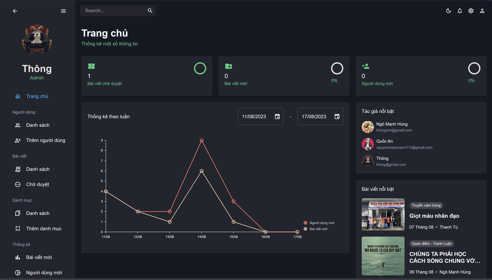
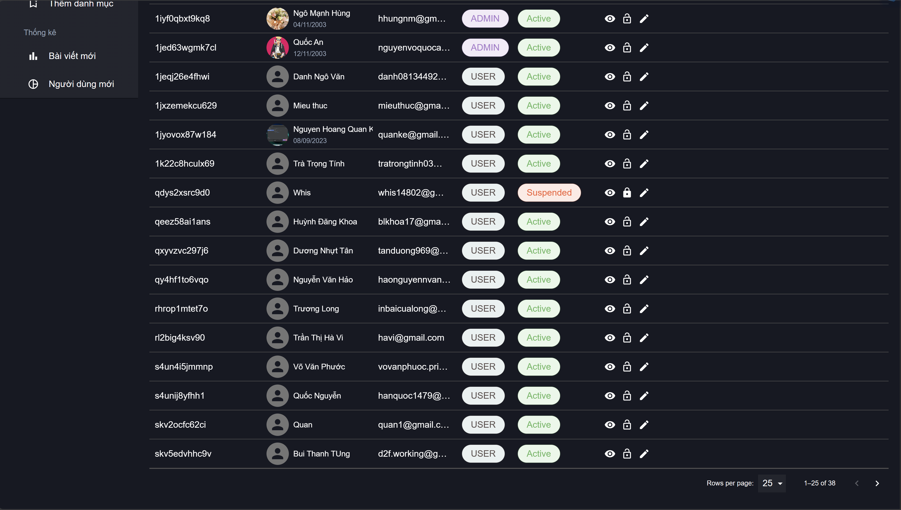

# Giới thiệu dự án Episteme

Episteme là một dự án blog cộng đồng, giúp mọi người có thể kết nối và chia sẻ những kiến thức của mình đến cho cộng đồng

Dự án này do nhóm sinh viên năm cuối tại Cao đẳng FPT thực hiện. Mục tiêu của chúng tôi là xây dựng một nền tảng trang blog cộng đồng, nơi mọi người có thể chia sẻ kiến thức, thảo luận và học hỏi cùng nhau. Hãy cùng chúng tôi trải nghiệm một không gian học tập và giao lưu thú vị!

# Công nghệ sử dụng
- Frontend: ReactJS
- Backend : Spring Boot
- Database: MySQL

# Hướng dẫn cài đặt
Dưới đây là các bước để bạn có thể cài đặt và chạy dự án "Episteme" trên máy tính của mình.

## Yêu Cầu Hệ Thống
Trước khi bắt đầu, hãy chắc chắn bạn đã cài đặt:
- Nodejs >= 18
- JDK >= 19
- Git

## Cài đặt

**Clone dự án**: Mở terminal và chạy lệnh sau để sao chép dự án về máy tính của bạn.
```git clone https://github.com/DNMThong/Episteme.git```

### Phần Backend (Spring Boot)

1. **Cài Đặt Java**: Hãy đảm bảo rằng bạn đã cài đặt JDK (Java Development Kit) trên máy tính của bạn. Tải JDK tại [https://www.oracle.com/java/technologies/javase-downloads.html](https://www.oracle.com/java/technologies/javase-downloads.html).

2. **Import Dự Án Vào IDE**: Mở thư mục `api` trong một môi trường phát triển tích hợp (IDE) như IntelliJ IDEA hoặc Eclipse.

3. **Cấu Hình Database**: Trong tệp `application.properties` bạn cần cung cấp thông tin cấu hình cơ sở dữ liệu MySQL như sau: 
```
spring.datasource.url=your_url_database
spring.datasource.username=your_username
spring.datasource.password=your_password
```

4. **Cài đặt các dependencies**: Tìm và chạy file `pom.xml` để tải các dependencies.

4. **Chạy Ứng Dụng**: Tìm và chạy hàm `main` của ứng dụng Spring Boot để khởi động backend.

### Phần Frontend (ReactJS)

1. **Cài Đặt Node.js**: Hãy đảm bảo rằng bạn đã cài đặt Node.js trên máy tính của bạn. Bạn có thể tải Node.js tại [https://nodejs.org/](https://nodejs.org/).

2. **Di chuyển vào thư mục dự án**: Sử dụng lệnh `cd` để điều hướng vào thư mục `frontend`.

3. **Cài đặt dependencies**: Chạy lệnh sau để cài đặt các thư viện cần thiết cho frontend.
```npm install```

4. **Chạy Ứng Dụng**: Sau khi cài đặt thành công, chạy lệnh sau để khởi động ứng dụng React.
```npm start```

Truy cập ứng dụng frontend qua trình duyệt tại `http://localhost:5173`.

# Các giao diện dự án

### Giao diện người dùng

1. Trang chủ


2. Trang tạo bài viết


3. Trang đọc bài viết


4. Trang cá nhân


5. Trang sửa thông tin


### Giao diện quản trị

1. Trang chủ



2. Trang quản lý người dùng




3. Trang thêm người dùng và sửa người dùng


4. Trang quản lý bài viết và duyệt bài viết


